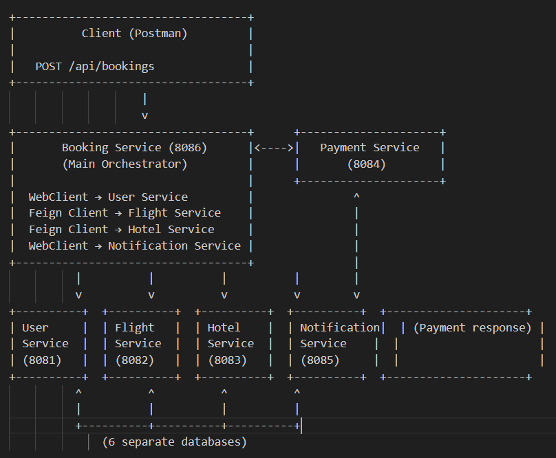

# Smart Travel Booking Platform

A distributed microservices-based travel booking system built with **Spring Boot 3.5**, **Java 17**, **Hybranate**, **Feign Client**, and **WebClient**.  
Demonstrates inter-service communication using modern Spring practices (no deprecated RestTemplate).

## Microservices Overview

| Service              | Port  | Purpose                              | Communication Method (from Booking Service) |
|----------------------|-------|--------------------------------------|---------------------------------------------|
| **booking-service**  | 8086  | Main orchestrator                    | WebClient (User, Notification), Feign (Flight, Hotel) |
| **user-service**     | 8081  | Manages users and validation         | WebClient                                   |
| **flight-service**   | 8082  | Flight availability & reservation    | Feign Client                                |
| **hotel-service**    | 8083  | Hotel availability & reservation     | Feign Client                                |
| **payment-service**  | 8084  | Processes payments                   | WebClient (called by Booking)               |
| **notification-service** | 8085 | Sends booking confirmation emails    | WebClient                                   |

## Architecture Diagram



## Features & Communication Rules (as per assignment)

- No deprecated technologies (RestTemplate is **not** used)
- Feign Client used for Flight Service and Hotel Service
- WebClient used for User Service, Notification Service, and Payment → Booking flow
- Each service runs on its own port
- Proper DTOs, Entities, Exception Handling, and Response Models

## Booking Flow (Step-by-Step)

1. Client sends booking request to **Booking Service**  
   ```json
   POST http://localhost:8086/api/bookings
   {
     "userId": 1,
     "flightId": 200,
     "hotelId": 55,
     "travelDate": "2025-01-10"
   }
   ```

2. **Booking Service**:
   - Validates user (WebClient → User Service)
   - Checks & reserves flight (Feign → Flight Service)
   - Checks & reserves hotel (Feign → Hotel Service)
   - Calculates total cost
   - Saves booking as **PENDING**
   - Calls Payment Service (WebClient)
   - Sends notification (WebClient)
   - Updates booking to **CONFIRMED**

## Technologies Used

- Spring Boot 3.5.x
- Java 17
- Spring Cloud OpenFeign
- Spring WebFlux (WebClient)
- Lombok
- Springdoc OpenAPI (Swagger UI)
- Maven

## How to Run

### Prerequisites
- Java 17+
- Maven

### Steps
1. Clone the repository
   ```bash
   git clone url
   cd smart-travel-platform
   ```

2. Start all 6 services (in separate terminals or using VS Code multi-root workspace)
   ```bash
   cd user-service && mvn spring-boot:run
   cd ../flight-service && mvn spring-boot:run
   # Repeat for hotel, booking, payment, notification
   ```

3. Open Swagger UI (optional):
   - Booking Service: http://localhost:8080/swagger-ui.html
   - Other services: http://localhost:8081/swagger-ui.html, etc.

4. Use the provided Postman collection:
   - Import `travel booking app.postman_collection.json`

## Postman Collection

Available in: `travel booking app.postman_collection.json`

## Project Structure

```
smart-travel-platform/
├── booking-service/
├── flight-service/
├── hotel-service/
├── notification-service/
├── payment-service/
├── user-service/
├── postman-collection
└── README.md
```
